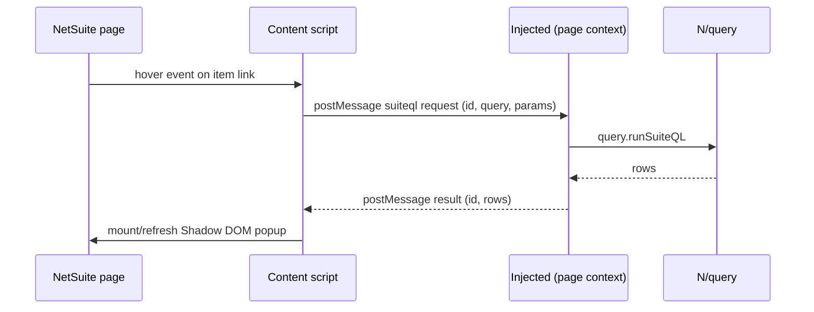

# Architecture

Detailed architecture for **NetSuite Stock Lens**. Covers the design
decisions and the contracts each module must honour.

## Tech stack

- **WXT** — Vite-based, Manifest V3 native, first-class TypeScript and
  React support. Faster reload loop than CRX boilerplate or Plasmo.
- **TypeScript strict** — catches the kinds of mistakes (undefined
  fields, null joins) that SuiteQL responses make easy to introduce.
- **React 18** — concurrent rendering helps keep the hover popup
  responsive while data streams in for two or three parallel queries.
- **Tailwind CSS** — used in the popup and options pages where we
  control the DOM root. Inside the content overlay we ship a separate
  built CSS file into the Shadow DOM to avoid host page bleed.
- **Zod** — every SuiteQL response is parsed through a schema before
  it leaves the query wrapper. Cheap insurance against schema drift
  between accounts or NetSuite versions.
- **Custom in-memory LRU + persistent cache** ([src/lib/cache.ts](../src/lib/cache.ts),
  [src/lib/persistent-cache.ts](../src/lib/persistent-cache.ts)) —
  covers in-flight dedup, TTL eviction and stale-while-revalidate. We
  deliberately avoid TanStack Query and a separate state library
  because React's own state plus this cache layer is enough for the
  popup's needs and keeps the content-script bundle small.
- **Vitest** — Vite-native, instant feedback, plays nicely with WXT.
- **Playwright** — used for E2E against a mocked NetSuite DOM.
  Cross-browser headless runs.
- **Biome** — single binary replaces ESLint + Prettier, much faster on
  watch.
- **pnpm** — disk-efficient, deterministic, strict peer resolution.

## Data flow diagram

```
+----------------------+        +-------------------------+        +-----------------------------+
|  NetSuite page DOM   |        |  Content script         |        |  Page-context injected      |
|  (isolated world)    |        |  (isolated world)       |        |  script (main world)        |
+----------+-----------+        +-----------+-------------+        +--------------+--------------+
           |                                |                                     |
           |  user hovers item link         |                                     |
           +------------------------------> | hover detected                      |
                                            |                                     |
                                            |  window.postMessage                 |
                                            |  { source: "nsl-content",           |
                                            |    id, type: "suiteql",             |
                                            |    query, params }                  |
                                            +-----------------------------------> |
                                            |                                     |
                                            |                                     | require(["N/query"], ...)
                                            |                                     | query.runSuiteQL(...)
                                            |                                     |
                                            |  window.postMessage                 |
                                            |  { source: "nsl-injected",          |
                                            |    id, type: "result", rows }       |
                                            | <-----------------------------------+
                                            |                                     |
        +---------------------------+       |                                     |
        | Shadow DOM popup mounted  | <-----+ render via React inside Shadow DOM  |
        | on document.body          |                                             |
        +---------------------------+                                             |
```

Same diagram in mermaid for IDE preview:



## Authentication strategy

The extension uses **page-context script injection** as its sole auth
strategy. The content script appends a `<script>` tag whose `src`
resolves to a bundled file shipped with the extension; the browser
places it in the page's main world where the AMD loader and the already
resolved `N/query` module live. Calling `require(["N/query"], ...)`
returns the same module NetSuite uses, and `query.runSuiteQL` rides on
the user's existing session cookies.

Why it works:

- **Zero configuration.** No Integration Record, no client ID, no
  client secret, no OAuth screen.
- **Reuses the active session.** The user is already logged in; we
  inherit the role, permissions, and 2FA they passed.
- **Works in every account the user touches.** No per-account setup.

Risk: if NetSuite changes the AMD loader (renames the module, swaps to
ESM, or restricts page-context injection via stricter CSP) this path
breaks. The planned mitigation is a fallback to an XHR call against
`/services/rest/query/v1/suiteql` authenticated with OAuth 2.0 + PKCE.
That code path is not implemented today and stays dormant until needed.

## Content script architecture

Four cooperating modules, all running in the content-script isolated
world.

1. **Detection layer** ([src/content/detection.ts](../src/content/detection.ts)).
   Three strategies in cascade:
   - URL pattern match against `/app/common/item/item.nl?id=<n>`
     anchors.
   - `data-itemid` attributes.
   - DOM fallback that inspects transaction line containers and reads
     hidden item input fields when no anchor is present.
   A `MutationObserver` re-scans on DOM changes and dedupes so the same
   anchor never gets two handlers.

2. **Hover handler** ([src/content/hover.ts](../src/content/hover.ts)).
   Three configurable trigger modes:
   - `shift-hover` — `mouseenter` while `event.shiftKey`.
   - `hover-delay` (default) — `mouseenter`, then `setTimeout(hoverDelayMs)`.
   - `long-press` — `mousedown`, then `setTimeout(500ms)`, cancel on
     `mouseup` or `mouseleave`.
   Mode and delay come from `chrome.storage.sync`, falling back to the
   defaults when unset.

3. **Popup mount** ([src/content/popup/HoverPopup.tsx](../src/content/popup/HoverPopup.tsx)).
   A host `<div>` is appended to `document.body`, a Shadow DOM is
   attached with `mode: "open"`, and the popup CSS bundle is injected
   into the shadow root. React renders inside the shadow root, so
   Tailwind classes do not leak in either direction. Position is
   computed from `getBoundingClientRect()` of the anchor with flip-to-
   keep-on-screen logic. `z-index: 999999`.

4. **Bridge to injected script** ([src/content/bridge.ts](../src/content/bridge.ts)).
   Sends `postMessage` requests with a UUID correlation `id`, keeps an
   internal `Map<id, { resolve, reject, timer }>`, validates incoming
   messages by source and origin, and rejects with `Error("suiteql-timeout")`
   after 3000 ms. The injected script is loaded lazily on first call.
   See [src/injected/README.md](../src/injected/README.md) for the wire
   protocol.

## SuiteQL strategy

Queries are first-class modules, not strings sprinkled inside React.

- All queries live in [src/lib/queries/](../src/lib/queries/), one file
  per logical query. Each file exports the SQL string as a tagged
  template literal, the Zod schema for the response, and a typed
  wrapper function that runs the query through the bridge and returns
  parsed rows.
- **In-flight deduplication.** The cache key includes the query name
  and parameters; concurrent callers receive the same `Promise`.
- **L1 cache (in-memory):** a single LRU, 200 entries, 60 second
  TTL, keyed `item:${accountId}:${itemId}:...`. Lives in
  [src/lib/cache.ts](../src/lib/cache.ts).
- **L2 cache (persistent):** a second layer on top of `chrome.storage.local`
  (500 entries, 60 s fresh TTL, up to 300 s stale-while-revalidate). On
  a stale hit the popup paints immediately from L2 and a background
  refetch re-renders when fresh data arrives.
- **Query budgets.** With all opt-ins on, up to four queries fire per
  hover. Per-query timeout is 2000 ms; total budget per hover is
  3000 ms, after which the popup renders whatever finished and marks
  the rest as partial.

## Storage layout

Two buckets, each with a clear lifetime and threat profile.

- **`chrome.storage.sync`** — user preferences only. Synchronised
  across the user's Chrome profile, capped at ~100 KB:
  - `triggerMode` (`shift-hover` | `hover-delay` | `long-press`)
  - `hoverDelayMs` (200–1000 integer)
  - `enabled` (extension master switch)
  - Per-feature opt-in flags (recent sales, demand, smart prefetch)

- **`chrome.storage.local`** — local-only, never synced:
  - Inventory cache (`item:${accountId}:${itemId}:...`) with TTL
    metadata.
  - Schema probe results per account (`schema:${accountId}`) with a
    30-day expiry.

## Threat model & data handling

- The extension **never** sends NetSuite data to a remote server. All
  inventory data, schema probe results, and queries stay on the user's
  machine in `chrome.storage.local` and the in-memory LRU.
- The shipped bundle is open source under the MIT License and
  inherently readable once installed (Chrome Web Store ships unpacked
  code). The build is minified for size only, not obfuscated; source
  maps are **not** shipped. Treat the bundle as public: no secrets in
  code, no embedded keys, no internal URLs.
- Every source file carries the MIT license header. Adding new source
  files? Copy the header from a sibling.
- Permissions are minimised by design: `storage` and `host_permissions`
  restricted to NetSuite domains only.
- The content script validates every inbound `postMessage` against
  `event.source === window`, `event.origin === window.location.origin`,
  and `event.data.source === "nsl-injected"` before acting on it.
- No telemetry. Any future telemetry must be explicit opt-in.
